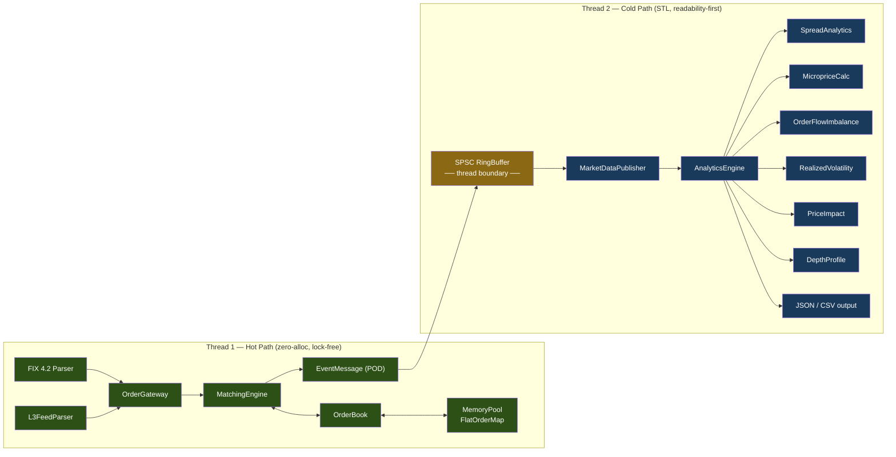

# hft-orderbook-engine

A high-performance limit order book and matching engine in C++17 with lock-free concurrency, zero-allocation hot path, and market microstructure analytics. Designed for sub-microsecond latency.

## Motivation

I wanted to understand market microstructure from the ground up — not by reading about it, but by building the core infrastructure myself. A limit order book is where price discovery actually happens: every bid, every ask, every match. Building one forces you to think about cache lines, memory layout, and nanosecond budgets while simultaneously learning the financial mechanics of how markets work.

## What's Implemented

**Matching Engine**
- Price-time priority (FIFO) matching
- Order types: Limit, Market, Immediate-or-Cancel, Fill-or-Kill, Good-Till-Cancel, Iceberg (hidden quantity)
- Order modify (amend price/quantity) with cancel-and-replace semantics — modified orders lose time priority and can trigger crossing matches
- Self-trade prevention by participant ID
- Full order lifecycle: New → Ack → Partial Fill → Fill/Cancel/Modify, with event generation at each transition

**Low-Latency Architecture**
- Zero heap allocations on the hot path — pre-allocated memory pool / slab allocator for all Order objects
- Cache-optimized price level storage (contiguous sorted array, not `std::map`)
- O(1) best bid/ask access
- No virtual functions, no exceptions, no RTTI on the hot path
- Lock-free SPSC ring buffer for inter-thread communication, cache-line padded to prevent false sharing
- Fixed-size binary POD messages — no serialization overhead

**Data Replay**
- Ingest historical L3 (order-by-order) data from Binance CSV dumps
- Reconstruct full order book state at any point in time
- Validate matching behavior against known exchange sequences

**Market Microstructure Analytics**
- Bid-ask spread and effective spread over time
- Microprice: size-weighted midpoint as fair value estimator
- Order flow imbalance (buy vs sell volume)
- Realized volatility (tick-level and time-bar)
- Price impact curves and Kyle's Lambda estimation
- Order book depth and shape analysis
- Output: JSON summary + CSV time series

**Python Bindings (pybind11)**
- `import hft_orderbook` — full access from Python for quant research workflows
- Replay CSV data and inspect results: `ReplayEngine`, `MultiInstrumentReplayEngine`
- Read-only order book queries: BBO, spread, mid price, depth snapshots
- All 6 analytics modules: spread, microprice, imbalance, volatility, price impact, depth
- Price conversion helpers: fixed-point `int64` <-> `float`
- Zero-overhead C++ analytics wiring via `register_analytics()` (no Python callback overhead)

**FIX 4.2 Protocol**
- Inbound parser: `35=D` New Order Single, `35=F` Cancel Request, `35=G` Cancel/Replace
- Outbound serializer: `35=8` Execution Reports (all event types)
- ~20 FIX tags, checksum validation, BodyLength validation
- SOH and pipe-delimited message support (auto-detected)
- ClOrdID to OrderId mapping via FNV-1a hash
- 30 sample FIX messages covering a realistic BTCUSDT trading scenario

**Grafana Dashboard**
- Docker-based visualization stack: InfluxDB 2.7 + Grafana 11.4
- Two pre-provisioned dashboards with 21 panels total
- Overview: trade price/microprice, spread, order flow imbalance, depth imbalance, volatility, aggressor distribution
- Depth & Impact: Kyle's Lambda, temporary/permanent impact, spread analysis, bid/ask depth profiles
- One-command launch (`launch.ps1` / `launch.sh`): starts containers, ingests analytics data, opens browser
- Python ingestion script: CSV time series + JSON aggregates into InfluxDB

**Benchmarking**
- Nanosecond-precision latency histograms via rdtsc (p50, p90, p99, p99.9, max)
- Throughput measurement under sustained mixed workload
- Google Benchmark + custom rdtsc-based percentile harness with overhead calibration
- Automated benchmark script (`scripts/run_benchmarks.ps1`)

## Performance

Measured on Intel Core i7-10750H (6C/12T, 2.69 GHz), 16 GB RAM, Windows 10 Pro 10.0.19045, MSVC 14.44 (VS 2022 Build Tools), Release `/O2`, Ninja.

### Latency (1,000,000 samples per operation, rdtsc overhead subtracted)

| Operation | min | p50 | p90 | p99 | p99.9 | max |
|---|---|---|---|---|---|---|
| Add order (no match) | 25 ns | 124 ns | 150 ns | 678 ns | 4.7 us | 162 us |
| Cancel order | 12 ns | 130 ns | 227 ns | 692 ns | 4.8 us | 166 us |
| Match (single level) | 726 ns | 821 ns | 935 ns | 1.4 us | 5.4 us | 386 us |
| Match (5 levels) | 827 ns | 1.0 us | 1.4 us | 2.0 us | 6.4 us | 313 us |
| SPSC push+pop | < 1 ns | < 1 ns | < 1 ns | 2 ns | 6 ns | 82 us |

### Throughput

| Benchmark | Result |
|---|---|
| Sustained mixed workload (60% add / 30% cancel / 10% match) | **6.0 M msgs/s** |
| Google Benchmark: add order (mean) | 176 ns/op |
| Google Benchmark: cancel order (mean) | 205 ns/op |
| Google Benchmark: add+cancel mixed (mean) | 100 ns/op |

### Analysis

The matching benchmarks include setup cost (placing resting orders on the book before each match), so they overestimate pure matching latency. The `min` values for add/cancel show the raw operation cost reaches 12-25 ns when caches are warm. Tail latencies (p99.9, max) are dominated by OS scheduling jitter on Windows — Linux with `isolcpus` and `taskset` would reduce these significantly. The SPSC ring buffer push+pop is effectively free (< 1 ns median), confirming zero overhead for the lock-free inter-thread transport.

## Building

### Prerequisites
- C++17 compiler (MSVC 14.x, GCC 9+, or Clang 10+)
- CMake 3.20+
- Ninja build system

### Build
```bash
cmake -B build -DCMAKE_BUILD_TYPE=Release -G Ninja
cmake --build build
```

### Run
```bash
# Latency histogram benchmark (rdtsc-based, p50/p90/p99/p99.9/max)
./build/benchmarks/bench_latency

# Google Benchmark suite
./build/benchmarks/bench_orderbook
./build/benchmarks/bench_matching
./build/benchmarks/bench_spsc

# Replay historical data with analytics
./build/replay --input data/btcusdt_l3_sample.csv --analytics

# Unit tests (411 tests)
cd build && ctest --output-on-failure
```

### Python Bindings (optional)
```bash
# Build with Python bindings (requires Python 3.7+)
cmake -B build -DBUILD_PYTHON_BINDINGS=ON -DCMAKE_BUILD_TYPE=Release -G Ninja
cmake --build build

# Verify import
cd python && python -c "import hft_orderbook; print(hft_orderbook.PRICE_SCALE)"

# Run examples
python python/examples/simple_replay.py       # Replay + book state
python python/examples/analytics_demo.py      # Replay + all 6 analytics modules
python python/examples/multi_instrument.py    # Multi-symbol replay + per-instrument analytics
```

### Grafana Dashboard
```bash
# Generate analytics data
./build/replay --input data/btcusdt_l3_sample.csv --analytics \
  --analytics-csv data/analytics.csv --analytics-json data/analytics.json

# Launch dashboard (one command — starts Docker, ingests data, opens browser)
./grafana/scripts/launch.sh          # Linux/WSL2
.\grafana\scripts\launch.ps1         # Windows PowerShell

# Or combine both steps:
./grafana/scripts/launch.sh --replay

# Open http://localhost:3000 — no login required
# Teardown: docker compose -f grafana/docker-compose.yml down -v
```

### Automated Benchmarking (Windows)
```powershell
.\scripts\run_benchmarks.ps1
```

## Project Structure

```
src/
  core/        — Order, Trade, PriceLevel, Side/OrderType enums
  orderbook/   — OrderBook, PriceLevelPool, MemoryPool (slab allocator)
  matching/    — MatchingEngine, validation, self-trade prevention
  gateway/     — OrderGateway (ingestion), MarketDataPublisher, InstrumentRouter
  transport/   — SPSC ring buffer, MPSC queue, binary message format
  feed/        — L3 data replay from CSV, FIX 4.2 parser/serializer
  analytics/   — Spread, microprice, imbalance, volatility, impact (single + multi-instrument)
  utils/       — High-resolution clock, logging, config
python/
  bindings/    — pybind11 Python bindings (core, orderbook, replay, analytics)
  examples/    — Example scripts (simple_replay, analytics_demo, multi_instrument)
tests/         — Google Test (per-component, 411 tests)
benchmarks/    — Google Benchmark + custom latency profiling
data/          — Sample L3 order data (single + multi-instrument), FIX 4.2 sample messages
grafana/       — Grafana + InfluxDB Docker stack, dashboards, ingestion scripts
```

## Architecture



**Hot path constraints:** no heap allocation, no virtual dispatch, no exceptions, no `std::string`, no `std::map`, no `shared_ptr`. Communication between threads via lock-free SPSC ring buffers with cache-line padding.

**Cold path:** normal C++17 with STL containers, spdlog, JSON output. Analytics run on a separate thread consuming market data events from the ring buffer.

## Dependencies

| Library | Purpose | Path |
|---|---|---|
| Google Test | Unit tests | Cold |
| Google Benchmark | Performance measurement | Cold |
| nlohmann/json | Config, analytics output | Cold |
| spdlog | Logging | Cold |
| TBB | Thread pool for analytics | Cold |
| pybind11 | Python bindings (optional) | Cold |

No external dependencies on the hot path.

## References

1. Harris, *Trading and Exchanges: Market Microstructure for Practitioners*
2. Cartea, Jaimungal & Penalva, *Algorithmic and High-Frequency Trading*
3. Ghosh, *Building Low Latency Applications with C++* (Packt)
4. Kyle, "Continuous Auctions and Insider Trading", Econometrica 1985

## License

MIT
